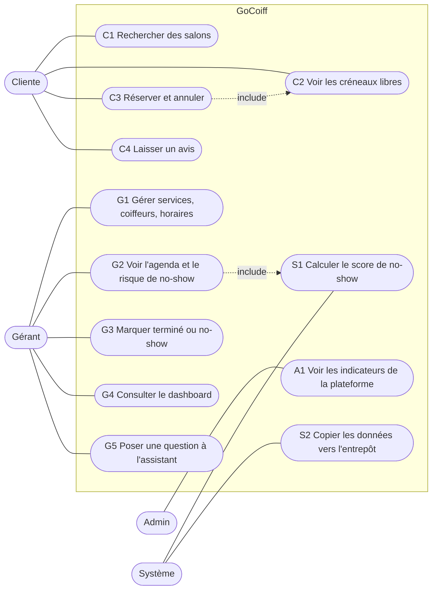

# Cas d'utilisation

Un ovale par story du backlog, relié à son acteur. La flèche pointillée `include` signifie que réserver passe obligatoirement par la consultation des créneaux libres.

```mermaid
flowchart LR
    Cliente([Cliente])
    Gerant([Gérant])
    Admin([Admin])
    Systeme([Système])

    subgraph GoCoiff
        C1([C1 Rechercher des salons])
        C2([C2 Voir les créneaux libres])
        C3([C3 Réserver et annuler])
        C4([C4 Laisser un avis])
        G1([G1 Gérer services, coiffeurs, horaires])
        G2([G2 Voir l'agenda et le risque de no-show])
        G3([G3 Marquer terminé ou no-show])
        G4([G4 Consulter le dashboard])
        G5([G5 Poser une question à l'assistant])
        S1([S1 Calculer le score de no-show])
        S2([S2 Copier les données vers l'entrepôt])
        A1([A1 Voir les indicateurs de la plateforme])
    end

    Cliente --- C1
    Cliente --- C2
    Cliente --- C3
    Cliente --- C4
    Gerant --- G1
    Gerant --- G2
    Gerant --- G3
    Gerant --- G4
    Gerant --- G5
    Systeme --- S1
    Systeme --- S2
    Admin --- A1

    C3 -.->|include| C2
    G2 -.->|include| S1
```
